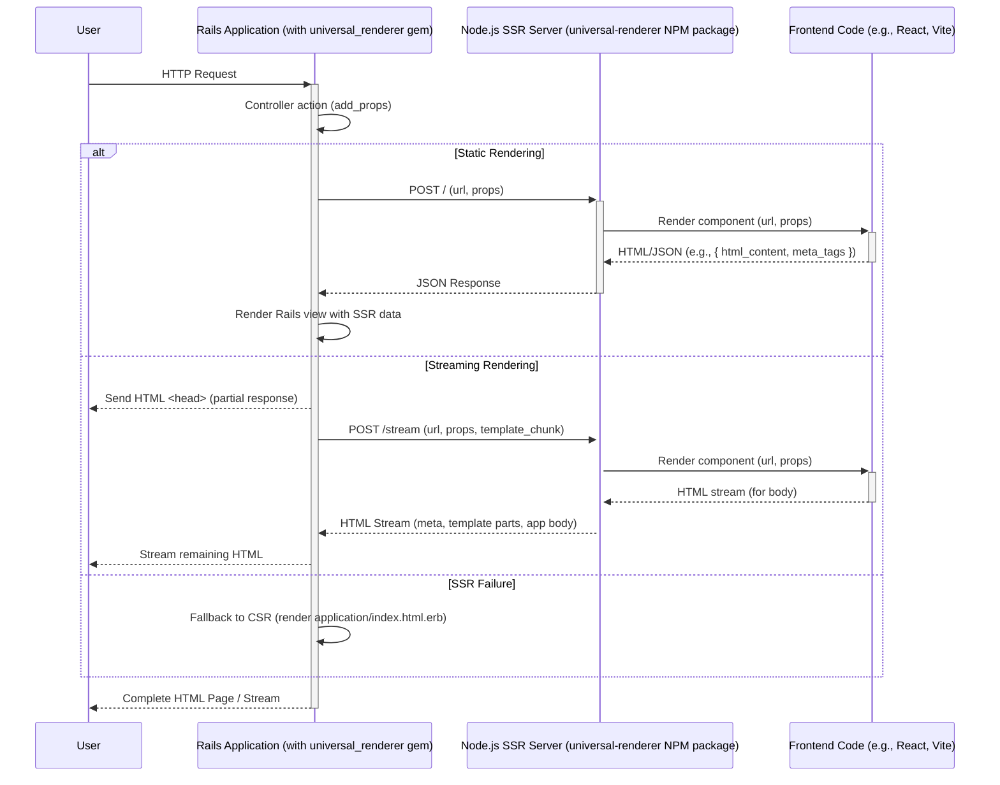

# Architecture Overview: universal_renderer

## 1. Introduction

`universal_renderer` is designed to enable Server-Side Rendering (SSR) for Ruby on Rails applications by integrating with an external Node.js-based SSR service. This document provides a high-level overview of its architecture, detailing the main components and their interactions.

The system comprises two primary parts:

1.  **`universal_renderer` Ruby Gem:** Integrates into a Rails application, intercepting rendering requests and coordinating with an external SSR server.
2.  **`universal-renderer` NPM Package:** A Node.js server (typically using Express and Vite) responsible for rendering the frontend application code and returning HTML or structured data.

## 2. Core Components

- **Ruby on Rails Application:** The host web application where the `universal_renderer` gem is installed.
- **`universal_renderer` Gem:**
  - **Configuration Module:** Allows setting SSR server URL, timeouts, and paths.
  - **Rendering Concern (`UniversalRenderer::Rendering`):** Overrides default Rails rendering to initiate SSR.
  - **HTTP Clients (`StaticClient`, `StreamClient`):** Responsible for making requests to the SSR server and handling responses.
  - **Props Management (`add_props`):** Allows passing data from Rails controllers to the SSR server.
  - **View Helpers (`SsrHelpers`):** Provides helpers like `ssr_meta` and `ssr_body` for layout integration.
- \*\*External SSR Server (Node.js - `universal-renderer` NPM package):
  - **HTTP Server (Express.js):** Listens for rendering requests from the Ruby gem.
  - **Rendering Engine:** Utilizes a frontend framework (e.g., React) and a bundler/dev server (e.g., Vite) to render the application component to an HTML string or structured JSON.
  - **Static Endpoint:** Handles requests for fully formed HTML/JSON payloads.
  - **Streaming Endpoint:** Handles requests where the Rails layout is partially sent, and the SSR server streams back the application content.
- **Frontend Application:** The JavaScript/TypeScript codebase (e.g., React, Vue) that is rendered on the SSR server.

## 3. Interaction Flow

The interaction between these components varies slightly depending on whether static or streaming SSR is employed.

### 3.1. Static Rendering Flow

1.  A user sends an HTTP request to a Rails application route.
2.  The Rails controller action is executed. `add_props` may be called to accumulate data for SSR.
3.  The `UniversalRenderer::Rendering` concern intercepts the rendering process (e.g., via `default_render`).
4.  The `StaticClient` in the gem constructs a JSON payload containing the request URL and accumulated props.
5.  The `StaticClient` sends a POST request to the configured static endpoint on the SSR server (e.g., `http://localhost:3001/`).
6.  The SSR server receives the request, uses the URL and props to render the relevant frontend component(s) to HTML (and potentially other metadata like head tags or initial state).
7.  The SSR server responds with a JSON object (e.g., `{ "html_content": "...", "meta_tags": "...", "initial_state": {} }`).
8.  The `StaticClient` receives the JSON response. The data is made available to a Rails view (e.g., `app/views/ssr/index.html.erb`) via an instance variable (e.g., `@ssr`).
9.  The Rails view uses this data to construct the final HTML page.
10. Rails sends the complete HTML response to the user's browser.

### 3.2. Streaming Rendering Flow

1.  A user sends an HTTP request to a Rails application route.
2.  The Rails controller action is executed. `add_props` may be called.
3.  The `UniversalRenderer::Rendering` concern intercepts rendering.
4.  Rails begins rendering the layout (e.g., `application.html.erb`). The layout **must** contain `ssr_meta` and `ssr_body` helpers.
5.  The gem captures the layout up to the `<!-- SSR_META -->` marker (output by `ssr_meta`) and streams this initial part of the HTML response to the client.
6.  The `StreamClient` in the gem constructs a JSON payload containing:
    - The request URL.
    - Accumulated props.
    - The `template`: the remaining part of the Rails layout, starting from `<!-- SSR_META -->` and including `<!-- SSR_BODY -->`.
7.  The `StreamClient` sends a POST request to the configured streaming endpoint on the SSR server (e.g., `http://localhost:3001/stream`).
8.  The SSR server receives the request. It uses the `template`, URL, and props:
    - It first sends the part of the `template` up to and including `<!-- SSR_META -->`.
    - It then injects its computed meta tags.
    - It sends the HTML from the `template` that was between `<!-- SSR_META -->` and `<!-- SSR_BODY -->`.
    - It then renders the frontend application and streams its HTML output (filling the `<!-- SSR_BODY -->` placeholder).
    - Finally, it appends the remainder of the `template` (after `<!-- SSR_BODY -->`).
9.  This combined stream is piped back through the Rails application directly to the user's browser.

### 3.3. Fallback Rendering

If the SSR process (either static or streaming) fails (e.g., timeout, SSR server error), the gem typically falls back to rendering a standard Rails view (e.g., `app/views/application/index.html.erb`), which should contain the client-side rendering (CSR) entry point for the application.

## 4. High-Level Diagram (Mermaid)

## 5. Key Architectural Decisions & Considerations

- **Decoupling:** The Ruby gem and the Node.js SSR server are decoupled via an HTTP interface. This allows them to be developed, deployed, and scaled independently.
- **Stateless SSR Server:** The SSR server is generally expected to be stateless, deriving all necessary information for rendering from the incoming request (URL, props, template).
- **Configuration over Convention:** While there are conventions (e.g., default paths), the system relies on explicit configuration for critical parameters like the SSR server URL.
- **Streaming for Time-to-First-Byte (TTFB):** The streaming mechanism is designed to improve perceived performance by sending the initial part of the page to the browser quickly while the main content is being rendered and streamed.
- **Flexibility in SSR Server Implementation:** The Ruby gem defines a contract (API endpoints, request/response formats). While an NPM package is provided, a different SSR server implementation could be used if it adheres to this contract.

## 6. Technology Stack (Primary)

- **Ruby Gem:** Ruby, Rails, Faraday (or similar HTTP client internally).
- **NPM Package (SSR Server):** Node.js, Express.js, Vite (common), React (common), TypeScript.

This document provides a foundational understanding of the `universal_renderer` architecture. Further detailed design documents may be necessary for specific components or features.
